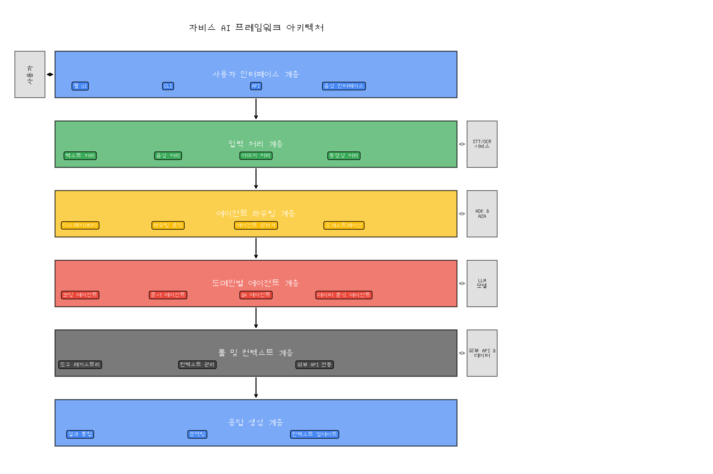
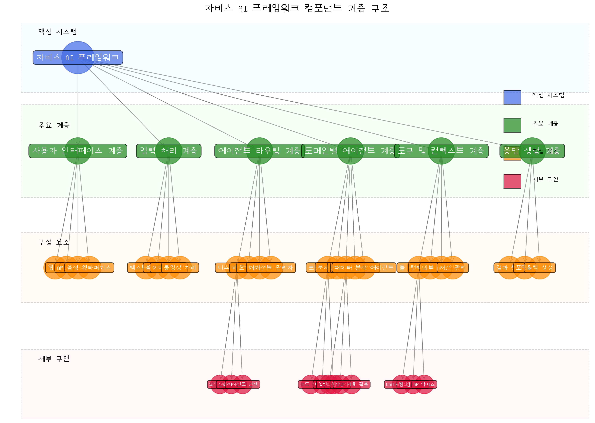
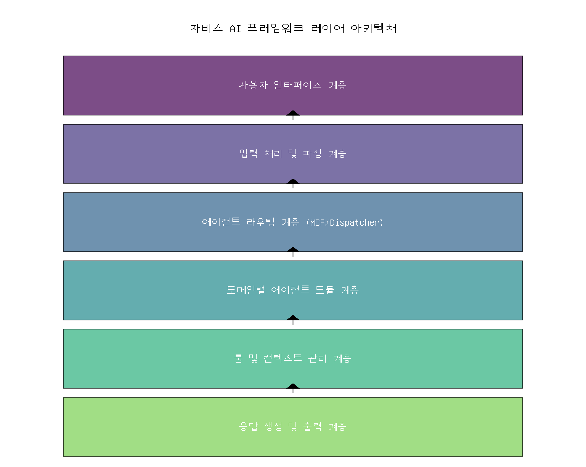
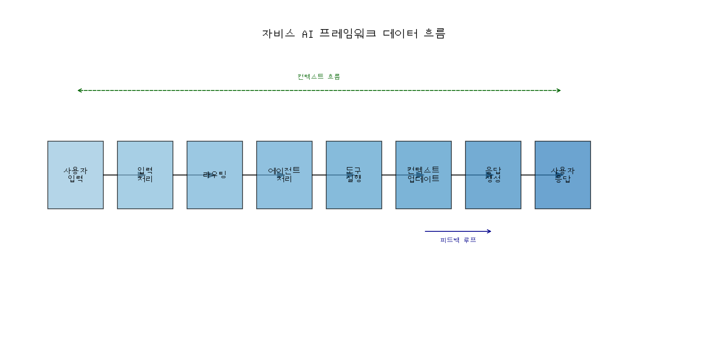
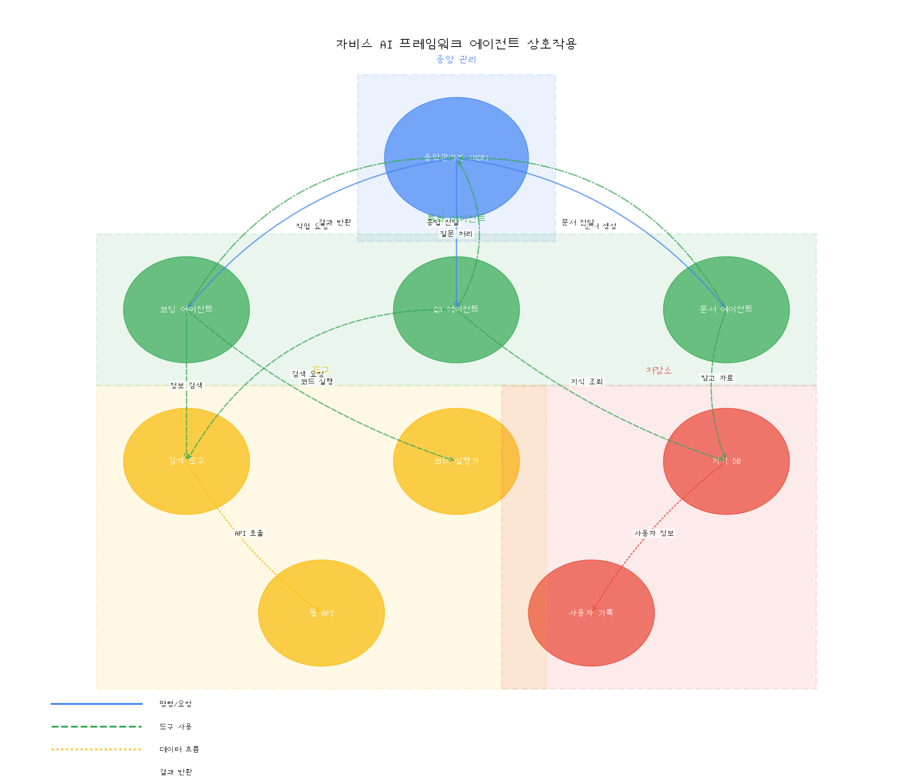
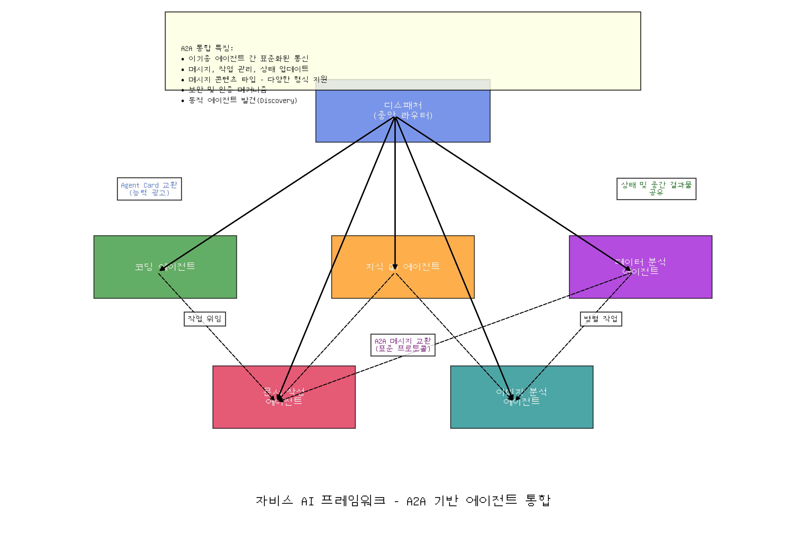
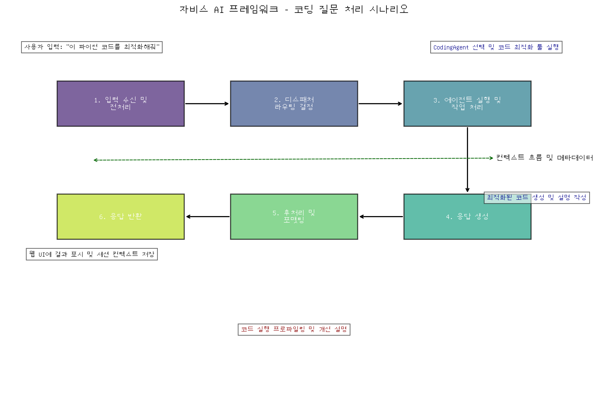

# 자비스 AI 프레임워크 설계 계획 (PLAN.md)

**문서 목적:** 본 문서는 Ubuntu 기반 Javis 스타일 AI 에이전트 프레임워크의 최종 설계 및 실행 계획을 담은 마스터 문서입니다. `javis_ai_framework_analysis.md`의 구조화된 분석과 `ubuntu_javis_ai_framework_design.md`의 상세 설계 철학을 통합하여 프로젝트의 청사진을 제공하며, 프로젝트 진행 중 지속적으로 업데이트되는 살아있는 문서(Living Document) 역할을 수행합니다.

## 목차
1. [프레임워크 개요](#1-프레임워크-개요)
2. [아키텍처 구성 요소](#2-아키텍처-구성-요소)
3. [계층별 기능 설명](#3-계층별-기능-설명)
4. [데이터 흐름 분석](#4-데이터-흐름-분석)
5. [핵심 컴포넌트 상세](#5-핵심-컴포넌트-상세)
6. [에이전트 간 상호작용](#6-에이전트-간-상호작용)
7. [구현 가이드](#7-구현-가이드)
8. [주요 처리 시나리오 예시](#8-주요-처리-시나리오-예시)
9. [최적화 및 보안 전략](#9-최적화-및-보안-전략)

## 1. 프레임워크 개요

자비스 AI 프레임워크는 Ubuntu 리눅스 환경에서 운영되며 웹 서비스로도 제공 가능한 다중 에이전트 기반 AI 시스템입니다. 사용자의 다양한 입력(텍스트, 음성, 이미지, 동영상)을 처리하고, 요청의 성격에 따라 자동으로 적합한 에이전트를 호출하여 다양한 요청에 응답할 수 있도록 설계되었습니다.

### 주요 목표
- 어떠한 종류의 질문(코딩, 문서 작성, 문화, 데이터 분석 등)에도 각 도메인에 특화된 에이전트가 대응합니다.
- 전체 시스템은 다중 에이전트를 가장 효율적으로 **오케스트레이션(조율)**하도록 구성됩니다.
- **Google Agent Development Kit (ADK)**와 **Agent2Agent (A2A)** 프레임워크만을 활용하여 구현합니다.
- 유사 기능의 에이전트들을 모듈화하고 중앙 관리 컴포넌트(MCP 또는 Dispatcher)를 통해 라우팅 및 제어합니다.

### 핵심 기술 스택
- **Google ADK**: 에이전트 개발, 실행, 통합, 배포의 핵심 플랫폼
- **Google A2A**: 에이전트 간 상호 운용성 확보를 위한 개방형 프로토콜
- **LLM 모델**: Gemini, Codey 등 다양한 목적별 모델 (Vertex AI Model Garden 활용)
- **번역 서비스**: Google Cloud Translation API 등 (다국어 지원용)
- **Ubuntu 리눅스**: 기본 운영 환경
- **기타**: Python, Docker, Kubernetes (확장성 고려)



## 2. 아키텍처 구성 요소

자비스 AI 프레임워크는 **다계층 에이전트 시스템**으로 구성되어 있으며, 각 계층은 특정 역할을 담당합니다.

### 컴포넌트 계층 구조

프레임워크의 주요 구성 요소는 다음과 같은 계층 구조로 조직화됩니다:



### 프레임워크 레이어 아키텍처

자비스 AI 프레임워크는 다음과 같은 계층 구조로 설계되었습니다:



### 주요 컴포넌트 계층
1.  **사용자 인터페이스 계층**: 웹 UI, CLI, API 등 다양한 사용자 접점 제공. ADK는 다양한 인터페이스 구축을 지원합니다.
2.  **입력 처리 및 파싱 계층**: 멀티모달 입력(텍스트, 음성, 이미지 등)을 전처리하고 **입력 언어 감지 후 영어로 변환**, 의도, 유형, 도메인 식별. ADK는 멀티모달 인터랙션과 모델 통합을 지원합니다.
3.  **에이전트 라우팅 계층 (MCP/Dispatcher)**: 중앙 관리자 역할. **영어로 번역된** 요청을 분석하여 최적의 에이전트 또는 에이전트 시퀀스를 결정하고 실행을 조율. 하이브리드 라우팅 전략 사용. (내부 처리는 영어로 진행)
4.  **도메인별 에이전트 모듈 계층**: 실제 작업을 수행하는 전문 에이전트 집합 (코딩, 문서 작성, QA 등). ADK 기반으로 구현 및 관리. (영어 기반으로 작업 수행)
5.  **툴 및 컨텍스트 관리 계층**: 에이전트가 사용하는 외부 도구(Tool Registry) 및 공유 컨텍스트 관리. **번역 툴 포함**. ADK의 툴 오케스트레이션 및 A2A의 Capability Discovery 활용.
6.  **응답 생성 및 출력 계층**: 에이전트 결과(영어) 취합, 최종 응답 생성 및 포맷팅. **최종 응답을 사용자의 원본 언어로 번역** 후 출력. A2A의 User Experience Negotiation 활용 가능.

## 3. 계층별 기능 설명

### 사용자 인터페이스 계층
- **역할**: 사용자 입력을 받고 응답을 반환.
- **구현**: 웹 UI(React, Vue 등), CLI(ADK CLI), API(FastAPI, Flask) 등. ADK는 다양한 인터페이스 생성을 지원합니다.

### 입력 처리 및 파싱 계층
- **역할**: 멀티모달 입력을 분석하여 의도, 엔티티, 도메인 등을 추출하고, **입력된 자연어를 감지하여 시스템 내부 표준 언어인 영어로 번역**.
- **기술**: 자연어 처리(NLU), 음성-텍스트 변환(STT), 이미지 분석(Vision API), 동영상 분석 등. **언어 감지 및 번역 API (Google Cloud Translation API) 활용**. Vertex AI 모델 활용.
- **ADK 활용**: 입력 처리 모듈을 ADK 에이전트로 래핑하여 파이프라인에 통합 가능.

### 에이전트 라우팅 계층 (MCP/Dispatcher)
- **역할**: 시스템의 중앙 관제탑. **영어로 번역된 입력 파서의 분석 결과**를 바탕으로 최적의 에이전트 또는 에이전트 시퀀스를 결정하고 실행을 조율.
- **하이브리드 라우팅 전략**:
    *   **ADK 내부 위임 활용**: Google ADK의 계층 구조와 자동 위임(auto delegation) 기능을 통해 내부 에이전트 간의 긴밀한 협업 및 라우팅 수행. 에이전트의 `description`을 기반으로 적합한 하위 에이전트에 자동으로 작업을 전달.
    *   **규칙 기반 라우팅**: 명확한 조건(예: 사용자 요청 키워드, 입력 유형)에 따라 특정 에이전트를 직접 지정하여 호출.
    *   **A2A 동적 검색 활용**: 필요한 능력이 내부 ADK 에이전트에 없거나, 외부 시스템 또는 다른 프레임워크로 구현된 이기종 에이전트와의 연동이 필요할 경우, **Agent Hub**의 A2A Discovery 서비스를 통해 능력 기반으로 에이전트를 동적으로 검색하고 A2A 프로토콜로 통신 시작.
- **맥락 관리**: Anthropic의 MCP 개념처럼, 작업 수행에 필요한 컨텍스트(이전 대화, 사용자 정보 등)와 도구(API 키, 공용 함수 등)를 적절한 에이전트(ADK 또는 A2A 기반)에 안전하게 공급.
- **오케스트레이션**: 다중 에이전트(ADK/A2A 혼합 가능) 워크플로우(순차, 병렬, 루프 등) 관리, 상태 추적, 결과 취합, 에러 핸들링.
- **구현**: Google ADK의 최상위 `LlmAgent` 또는 `Agent` 클래스를 기반으로 구현하여 ADK의 위임, 상태 관리 기능을 활용.

### 도메인별 에이전트 모듈 계층
- **역할**: 특정 전문 분야의 작업을 **영어 기반으로** 수행하는 에이전트.
- **예시**: 코딩 에이전트, 문서 작성 에이전트, 지식 QA 에이전트, 이미지 분석 에이전트, 데이터 분석 에이전트 등.
- **구현**: 각 에이전트는 Google ADK의 `LlmAgent` 또는 `Agent` 클래스를 사용하여 모듈식으로 구현. 독립적인 개발, 테스트, 배포 가능. ADK의 설명 기반 위임을 통해 Dispatcher 또는 다른 에이전트로부터 작업을 위임받음.

### 툴 및 컨텍스트 관리 계층
- **역할**: 에이전트가 공유하는 리소스(도구, 데이터, 컨텍스트)를 관리하고 제공. **번역 툴 포함**.
- **툴 레지스트리**:
    *   외부 API(웹 검색, **번역**), 내부 함수(코드 실행기, DB 조회), 데이터 저장소 등에 대한 접근 인터페이스 제공.
    *   ADK의 툴 기능을 활용: Python 함수를 Docstring과 함께 정의하면 LLM이 자연스럽게 호출 가능.
    *   에이전트별 툴 사용 권한 관리. Dispatcher가 작업 할당 시 필요한 툴 목록과 접근 정보를 에이전트에 전달.
- **컨텍스트 관리**:
    *   대화 이력, 사용자 프로필, 세션 상태 등 공유 컨텍스트 저장 및 관리.
    *   필요한 컨텍스트를 자동으로 타겟 에이전트에게 전달 (ADK 상태 관리, A2A 메시지 필드 활용).
    *   벡터 DB 등을 활용하여 관련성 높은 정보 검색 및 주입.

### 응답 생성 및 출력 계층
- **역할**: 작업 에이전트로부터 반환된 **영어 결과**(텍스트, 데이터, 이미지 등)를 통합하고, 최종 사용자에게 적합한 형태로 가공하여 **사용자의 원본 언어로 다시 번역** 후 출력.
- **기능**: 결과 병합, 요약, 마크다운/HTML 포맷팅, 시각화 데이터 변환, **최종 응답 번역 (번역 API 활용)** 등.
- **A2A 활용**: User Experience Negotiation 기능을 통해 클라이언트(UI)가 선호하는 출력 형식 및 **언어**를 에이전트와 협의 가능.

## 4. 데이터 흐름 분석

자비스 AI 프레임워크 내에서 데이터가 처리되는 일반적인 흐름은 다음과 같습니다.



### 처리 과정 설명
1.  **사용자 입력**: 사용자가 웹 UI, CLI, API 등 다양한 인터페이스를 통해 **원본 언어로** 요청(텍스트, 음성, 이미지 등) 전달.
2.  **입력 처리**: 입력 처리 계층에서 요청 분석, **언어 감지 및 영어로 번역**, 의도/엔티티 추출, 메타데이터 생성 등 수행.
3.  **라우팅**: Dispatcher가 **영어로 번역된 입력**과 컨텍스트를 기반으로 최적의 에이전트(들)를 결정 (ADK 위임, 규칙 기반, A2A 검색 등).
4.  **에이전트 처리**: 선택된 에이전트(들)가 **영어 기반으로** 작업을 수행. 필요시 툴 레지스트리를 통해 도구를 호출하고, 컨텍스트 관리자를 통해 추가 정보 획득. 에이전트 간 협업(순차/병렬) 발생 가능 (ADK 위임 또는 A2A 통신).
5.  **도구 실행**: 에이전트의 요청에 따라 외부 API 호출(번역 포함), 코드 실행 등 실제 도구 실행.
6.  **컨텍스트 업데이트**: 작업 진행 중 발생한 중요 정보나 상태 변경을 컨텍스트 관리자에 기록 (주로 영어로 저장).
7.  **응답 생성**: 작업 완료 후, Dispatcher 또는 전담 응답 생성 에이전트가 **영어 결과**를 취합/가공하여 최종 응답 생성.
8.  **사용자 응답**: 최종 **영어 응답을 사용자의 원본 언어로 번역**하여 사용자 인터페이스 계층을 통해 사용자에게 전달.

## 5. 핵심 컴포넌트 상세

### 5.1. 입력 파서 (Input Parser)
- **역할**: 사용자 입력을 해석하여 구조화된 정보로 변환하고, Dispatcher가 라우팅 결정을 내리는 데 필요한 정보(의도, 도메인, 주요 엔티티, 모달리티 등)를 추출. **입력 언어를 감지하고 영어로 번역하는 기능 포함**.
- **처리 기술**: 멀티모달 LLM(예: Gemini) 활용. **언어 감지 및 번역 API(Google Cloud Translation API) 필수 연동**.
- **컨텍스트 인식**: 대화 이력을 참조하여 현재 요청의 맥락을 파악하고 관련 정보를 Dispatcher에 전달.

### 5.2. 디스패처 (MCP 역할의 관리자)
- **역할**: 시스템의 중앙 오케스트레이터. **영어로 번역된 입력 파서의 분석 결과**를 바탕으로 가장 적합한 에이전트 또는 에이전트 워크플로우를 동적으로 구성하고 실행을 관리.
- **라우팅 실행 메커니즘 상세**:
    *   **ADK 내부 위임**: 에이전트 계층 구조 내에서 `description` 기반 자동 위임 적극 활용. 빠르고 긴밀한 내부 협업에 유리.
    *   **규칙 기반 직접 호출**: 특정 키워드나 패턴에 매칭되는 요청은 사전에 정의된 에이전트로 즉시 라우팅. 예측 가능하고 빠른 처리가 필요할 때 사용.
    *   **A2A 검색 요청**: 내부 역량 부족 또는 외부 시스템 연동 필요시, Agent Hub에 A2A Discovery 요청. Agent Hub는 등록된 에이전트들의 Agent Card(능력 명세)를 검색하여 최적 에이전트 후보 목록 반환. Dispatcher는 이 정보를 바탕으로 A2A 통신 시작.
- **오케스트레이션**: ADK의 위임 체인 관리와 A2A의 Task Management 표준을 결합하여 복잡한 워크플로우(ADK 에이전트와 A2A 에이전트 혼합 가능) 조율. 상태 추적, 결과 취합, 에러 처리 수행.
- **구현**: Google ADK의 `LlmAgent`를 상속받아 구현. ADK의 상태 관리, 툴 호출, LLM 연동 기능을 기반으로 라우팅 및 오케스트레이션 로직 추가.

### 5.3. 에이전트 허브 (Agent Hub)
- **역할**: 시스템 내/외부의 모든 에이전트(ADK 기반, A2A 호환)에 대한 중앙 레지스트리 및 관리 포인트 역할. A2A Discovery 서비스 제공.
- **기능**:
    *   **에이전트 등록 및 관리**: 에이전트 시작 시 자신의 정보(이름, 설명, 엔드포인트, Agent Card 등)를 허브에 등록. 상태(활성, 비활성, 오류 등) 업데이트.
    *   **Agent Card 관리**: 에이전트의 능력(capability), 입력/출력 형식, 사용 가능한 도구 등을 표준화된 JSON 형식(Agent Card)으로 저장 및 관리.
    *   **A2A Discovery 서비스**: Dispatcher 또는 다른 에이전트로부터 특정 능력(예: "Python 코드 최적화")을 수행할 수 있는 에이전트를 찾아달라는 요청(A2A Discovery Query)을 받으면, 저장된 Agent Card를 검색하여 조건에 맞는 에이전트 목록과 접속 정보 반환.
    *   **모니터링 지원**: 에이전트의 성능 지표(응답 시간, 처리량), 리소스 사용량 등을 수집하여 시스템 관리 및 부하 분산에 활용 (선택적 확장 기능).

### 5.4. 툴 레지스트리와 컨텍스트 관리
- **툴 레지스트리**:
    *   **역할**: 에이전트가 사용할 수 있는 모든 도구(내부 함수, 외부 API, 데이터베이스 접근 등)를 목록화하고 접근 인터페이스 제공. **번역 툴 포함**.
    *   **ADK 활용**: Python 함수를 `tool` 데코레이터 또는 `Tool` 객체로 정의. **번역 함수**도 툴로 정의 가능.
    *   **접근 제어**: 에이전트별로 사용 가능한 도구를 제한. Dispatcher가 에이전트 호출 시 허가된 도구 목록과 필요 정보(API 키 등)를 안전하게 전달.
- **컨텍스트 관리**:
    *   대화 이력, 사용자 프로필, 세션 상태 등 공유 컨텍스트 저장 및 관리.
    *   필요한 컨텍스트를 자동으로 타겟 에이전트에게 전달 (ADK 상태 관리, A2A 메시지 필드 활용).
    *   벡터 DB 등을 활용하여 관련성 높은 정보 검색 및 주입.

## 6. 에이전트 간 상호작용



에이전트 간 상호작용은 복잡한 문제를 해결하기 위한 핵심 메커니즘입니다. 자비스 프레임워크는 ADK와 A2A를 통해 다양한 협업 패턴을 지원합니다.

* **협업 패턴:**
    *   **순차적 협업**: 한 에이전트의 출력이 다음 에이전트의 입력으로 사용 (예: 데이터 분석 → 시각화 → 보고서 작성). ADK의 위임 체인이나 A2A Task의 순차 실행으로 구현.
    *   **병렬 협업**: 여러 에이전트가 동시에 독립적인 하위 작업을 수행 후 결과 통합 (예: 여러 문서 요약 후 종합 보고). A2A 기반 병렬 Task 실행 요청으로 구현.
    *   **위임 기반**: 상위 에이전트(Dispatcher 또는 복합 에이전트)가 특정 하위 작업을 전문 에이전트에게 위임. ADK의 자동 위임 또는 A2A 기반 명시적 작업 요청으로 구현.

* **통신 메커니즘:**
    *   **ADK 내부 통신**: 같은 ADK 프로세스 내 에이전트 간에는 Python 함수 호출, 공유 메모리, ADK 상태 관리 객체를 통해 **영어 기반으로** 효율적으로 통신 및 데이터 공유.
    *   **A2A 외부 통신**: 서로 다른 프로세스, 서버, 또는 다른 기술 스택으로 구현된 에이전트 간에는 표준 A2A 프로토콜 사용. A2A 메시지 내 데이터는 **영어를 기본으로 하되, 필요시 언어 정보 태깅 고려**.
    *   **컨텍스트 공유**: 작업 수행에 필요한 컨텍스트(세션 ID, 사용자 정보, 중간 결과물 등)는 ADK 상태 관리 또는 A2A 메시지 페이로드 내 표준 필드를 통해 전달.

이러한 유연한 상호작용 방식을 통해, 단일 에이전트로는 해결하기 어려운 복잡한 요청을 여러 에이전트가 협력하여 효과적으로 처리할 수 있습니다.

## 7. 구현 가이드

### Google ADK의 역할 및 활용

Google ADK(Agent Development Kit)는 자비스 프레임워크의 에이전트 개발 및 실행을 위한 핵심 기반입니다.

*   **에이전트 구현 간소화**: Python `Agent` / `LlmAgent` 클래스를 상속받아 에이전트의 핵심 로직(프롬프트 정의, 모델 선택, 툴 연결)에만 집중하여 빠르게 개발 가능. ADK 런타임이 통신, 상태 관리 등 나머지 인프라 처리.

    ```python
    # 예시: ADK를 활용한 간단한 에이전트 정의
    from google.adk import Agent, AgentResponse, LlmConfig, llm_agent
    from google.ai.generativelanguage import Tool, FunctionDeclaration, ToolConfig
    
    # 예시 Tool 정의 (Docstring이 중요)
    def get_current_weather(location: str, unit: str = "celsius") -> str:
        """지정된 위치의 현재 날씨 정보를 가져옵니다."""
        # 실제 날씨 API 호출 로직 구현
        return f"{location}의 현재 날씨는 맑음, 기온은 25{unit}입니다."

    weather_tool = Tool(
        function_declarations=[
            FunctionDeclaration(
                name="get_current_weather",
                description="지정된 위치의 현재 날씨 정보를 가져옵니다.",
                parameters={
                    "type_": "OBJECT",
                    "properties": {
                        "location": {"type_": "STRING", "description": "날씨를 알고 싶은 도시 이름 (예: 서울)"},
                        "unit": {"type_": "STRING", "description": "온도 단위 (celsius 또는 fahrenheit)", "enum": ["celsius", "fahrenheit"]},
                    },
                    "required": ["location"],
                },
            )
        ]
    )
    
    @llm_agent(
        name="WeatherAgent",
        description="날씨 정보 제공 및 관련 질문에 답변합니다.",
        tools=[weather_tool],
        llm_config=LlmConfig(model="gemini-pro") # 사용할 LLM 모델 지정
    )
    class WeatherAgent:
        # ADK가 LLM 호출, 툴 사용 결정, 실행 등을 자동으로 처리
        pass 
    ```

*   **다중 에이전트/서브에이전트 구조**: 에이전트 간의 계층 구조를 정의하고, 상위 에이전트가 하위 에이전트에게 작업을 **위임(delegation)**하는 메커니즘 제공. 특히, 에이전트의 `description` 필드를 기반으로 LLM이 가장 적합한 하위 에이전트를 **자동으로 선택하여 위임(auto delegation)**하는 강력한 기능 활용 가능. 이를 통해 Dispatcher의 라우팅 로직을 단순화하고 유연성 확보.

*   **툴 통합과 상태 관리**: 에이전트 내에서 사용할 Python 함수(Tool)를 쉽게 통합하고 관리. ADK가 LLM과의 상호작용을 통해 언제 어떤 툴을 호출할지 결정하고 실행하는 과정을 오케스트레이션. 세션별 대화 기록 등 상태 정보 저장 및 관리 기능 내장.

*   **멀티모달 및 스트리밍**: 텍스트 외 이미지, 오디오 등 다양한 입력 처리 및 양방향 스트리밍 통신 지원. 실시간 대화형 애플리케이션 구축 가능.

*   **배포 및 인터페이스**: 개발된 에이전트를 CLI, 웹 인터페이스(ADK Web), API 서버 등 다양한 형태로 쉽게 실행 및 배포. Google Cloud Vertex AI Agent Engine 등 클라우드 환경 배포 지원. 개발 환경과 배포 환경 간의 코드 일관성 유지 용이.

*   **평가 및 디버깅**: 에이전트 성능 평가(Evaluation) 및 디버깅을 위한 도구와 로깅 기능 제공.

### Google A2A 활용 방법

Google A2A(Agent-to-Agent)는 서로 다른 시스템 간 에이전트 상호 운용성을 위한 표준 프로토콜입니다. ADK 기반 내부 시스템을 외부 세계와 연결하고 확장하는 데 사용됩니다.



*   **이기종 에이전트 통신 표준화**: ADK로 만들어지지 않았거나, 다른 회사/조직에서 만든 에이전트와도 표준화된 방식으로 통신 가능. 메시지 구조, 작업(Task) 정의, 상태 업데이트, 인증 방식 등을 규격화하여 플러그 앤 플레이 통합 지원. 시스템 확장성 및 미래 호환성 확보.

*   **에이전트 능력 광고 및 검색 (Discovery)**:
    *   **Agent Card**: 각 에이전트는 자신의 능력, 사용 가능한 도구, 통신 엔드포인트 등을 JSON 형식의 Agent Card로 정의하여 **Agent Hub**에 등록.
    *   **Discovery**: Dispatcher나 다른 에이전트가 특정 능력이 필요할 때 Agent Hub에 A2A Discovery 쿼리를 보내면, 허브는 등록된 Agent Card를 검색하여 적합한 에이전트 정보 반환. 이를 통해 동적으로 에이전트 풀을 확장하고 최적의 에이전트 활용 가능.

*   **보안 및 인증**: 기관 간 안전한 통신을 위한 인증(Authentication) 및 인가(Authorization) 메커니즘 내장. JWT/OAuth와 유사한 방식으로 에이전트 신원을 확인하고, 허가된 범위 내에서만 요청을 처리하도록 보장. 메시지 암호화 등 추가 보안 옵션 제공. 엔터프라이즈 환경에서의 안전한 협업 지원.

*   **복잡한 워크플로우의 에이전트 협력**: 여러 에이전트가 참여하는 복잡한 작업(Task)을 정의하고 관리하는 표준 방식 제공. 순차/병렬 실행, 상태 추적, 중간 결과물(artifact) 공유 등을 지원하여 분산된 환경에서도 체계적인 협업 가능.

*   **지원 프레임워크 및 통합**: Google ADK 외에도 CrewAI, LangGraph, Genkit 등 다양한 에이전트 프레임워크 및 직접 구현한 시스템과도 통합 가능. 웹 앱, CLI, 서버 등 다양한 환경에서 A2A 프로토콜 구현 가능.

**ADK와 A2A의 시너지:** ADK는 프레임워크 내부의 에이전트 개발 및 긴밀한 오케스트레이션을 위한 강력한 도구이고, A2A는 이렇게 구축된 시스템을 외부 에이전트 및 시스템과 연결하고 상호 운용성을 확보하는 표준 인터페이스 역할을 수행합니다. 자비스 프레임워크는 이 두 기술을 효과적으로 조합하여 내부 효율성과 외부 확장성을 모두 달성합니다.

### 배포 및 확장 전략
- **로컬 개발/테스트**: ADK CLI를 활용하여 개별 에이전트 및 전체 시스템 로컬 실행 및 테스트.
- **웹 서비스 제공**:
    *   ADK Web을 사용하여 기본적인 웹 UI 제공.
    *   별도의 프론트엔드(React 등)를 구축하고, ADK 에이전트를 API 서버 형태로 배포하여 연동.
- **API 서버**: 핵심 기능을 RESTful API 형태로 제공하여 다른 서비스나 애플리케이션과 통합.
- **컨테이너화 및 오케스트레이션**: Docker를 사용하여 각 에이전트 또는 전체 시스템을 컨테이너화. Kubernetes를 활용하여 배포, 관리, 오토스케일링 수행. 이를 통해 높은 가용성과 확장성 확보.

## 8. 주요 처리 시나리오 예시

자비스 AI 프레임워크가 실제로 어떻게 다양한 요청을 처리하는지 시나리오 예시를 통해 살펴보겠습니다.



### 8.1. 코딩 질문 처리 흐름

**사용자 요청:** (웹 UI 통해) "다음 파이썬 코드를 개선해서 실행 속도를 높여줄 수 있어? 코드: ```python
for i in range(10000):
    result = some_complex_calculation(i)
```"

1.  **입력 수신 및 전처리:**
    *   웹 UI가 텍스트와 코드 블록을 포함한 요청 수신.
    *   입력 파서(ADK 에이전트 또는 통합 모듈)가 텍스트 분석하여 "코딩", "개선", "속도" 등 키워드 탐지. 코드 블록 추출.
    *   메타데이터 생성: `{ "domain": "coding", "intent": "code_optimization", "language": "python" }`
    *   관련 대화 이력 컨텍스트 확인.
2.  **디스패처 라우팅 결정:**
    *   메타데이터(`domain=coding`, `intent=code_optimization`)를 기반으로 `CodingAgent`가 가장 적합하다고 판단.
    *   ADK 자동 위임 메커니즘 활용: Dispatcher의 LLM이 `CodingAgent`의 `description`("코드 생성, 분석, 최적화 전문")을 보고 자동으로 작업 위임 결정 가능.
    *   또는 규칙 기반: "coding" 또는 "code_optimization" 인텐트 시 `CodingAgent` 호출 규칙 적용.
3.  **에이전트 실행 및 작업 처리:**
    *   Dispatcher가 `CodingAgent`에게 작업 할당 (ADK 내부 위임 방식). 요청 텍스트, 코드 블록, 컨텍스트 전달.
    *   `CodingAgent` (ADK `LlmAgent` 구현):
        *   자신의 프롬프트에 따라 코드 분석 및 최적화 방안 구상.
        *   필요시 내장된 코드 실행/프로파일링 툴(ADK Tool)을 호출하여 실제 성능 측정.
        *   코드 특화 LLM(Vertex AI Codey API 등)을 사용하여 최적화된 코드 제안 생성 요청.
4.  **응답 생성:**
    *   `CodingAgent`의 LLM이 최적화된 코드와 함께 변경 이유, 예상 성능 향상에 대한 설명을 생성.
    *   결과를 구조화된 형식(예: JSON 객체 내 코드와 설명 필드)으로 반환 (ADK `AgentResponse`).
5.  **후처리 및 포맷팅:**
    *   Dispatcher가 `CodingAgent`로부터 결과 수신.
    *   응답 생성 계층(또는 Dispatcher 자체)이 결과를 사용자 친화적인 마크다운 형식으로 변환 (코드 블록 하이라이팅, 설명 포맷팅).
    *   필요시, 추가적인 설명 에이전트(ParaphrasingAgent)를 호출하여 기술적 설명을 더 쉽게 풀어서 추가할 수도 있음 (선택적).
6.  **응답 반환:**
    *   최종 가공된 응답을 웹 UI로 전송하여 사용자에게 표시.
    *   요청 및 응답 내용을 컨텍스트 관리자에 기록하여 다음 대화에 활용.

### 8.2. 다른 시나리오에의 적용

*   **문화적 질문 ("조선시대 왕들의 평균 수명은?"):** Dispatcher → `KnowledgeQA_Agent` (ADK 위임) → `KnowledgeQA_Agent`가 웹 검색 툴(ADK Tool) 사용 → 결과 요약 및 반환.
*   **데이터 분석 요청 ("첨부된 CSV 파일 분석해서 매출 상위 5개 제품 알려줘"):** Dispatcher → `DataAnalysis_Agent` (ADK 위임) → `DataAnalysis_Agent`가 파일 처리 툴, 데이터 분석 라이브러리(pandas 등) 툴 사용 → 결과 데이터 생성 및 반환 → 필요시 `Visualization_Agent` 호출하여 그래프 생성.
*   **이미지 설명 요청 ("이 이미지에 뭐가 보여?"):** Dispatcher → `VisionAnalysis_Agent` (ADK 위임, Vision API 툴 사용) → 이미지 설명 텍스트 반환. 만약 사용자가 "강아지는 몇 마리야?"라고 후속 질문하면, Dispatcher는 이전 컨텍스트(이미지 정보, 설명)를 `KnowledgeQA_Agent`에게 전달하여 답변 처리.
*   **외부 시스템 연동 ("내 CRM 시스템에서 OOO 고객의 최근 주문 내역 조회해줘"):** Dispatcher가 내부 능력 부족 인지 → Agent Hub에 "CRM 조회" 능력 검색 (A2A Discovery) → 외부 `CRMAgent` 정보 획득 → A2A 프로토콜로 `CRMAgent`에게 작업 요청 → 결과 수신 및 사용자 반환.

**핵심:** 어떤 종류의 요청이 들어오든, 시스템은 유연하게 **가장 적합한 에이전트(들)를 동적으로 선택하고, 필요에 따라 ADK 내부 위임과 A2A 외부 통신을 조합하여 최적의 처리 파이프라인을 구성**하고 실행하여 사용자에게 가치 있는 응답을 제공하는 것을 목표로 합니다.

## 9. 최적화 및 보안 전략

### 성능 최적화
- **경량 모델 및 모델 믹스 활용**: 간단한 분류나 라우팅 작업에는 소형 LLM 또는 규칙 기반 로직 사용. 복잡한 추론이 필요할 때만 대형 모델 사용. ADK의 유연한 `LlmConfig`를 통해 에이전트별 최적 모델 선택.
- **병렬 처리 및 비동기화**: 서로 독립적인 하위 작업은 동시에 실행하여 전체 응답 시간 단축. ADK는 비동기 처리를 지원하며, A2A 기반 병렬 Task 실행도 가능. 웹 서버 등 I/O 바운드 작업은 비동기 라이브러리(asyncio) 활용.
- **캐싱**: 동일하거나 유사한 요청에 대한 최종 응답 캐싱. 에이전트의 중간 결과물(예: 웹 검색 결과, 데이터 분석 결과)도 캐싱하여 재활용. 입력 해시 또는 의미론적 유사성 기반 캐싱 적용.
- **컨텍스트 최소화 및 프롬프트 최적화**: 각 에이전트에게 작업 수행에 필요한 최소한의 컨텍스트만 전달하여 LLM 토큰 사용량 및 처리 시간 절약. 에이전트별 시스템 프롬프트를 명확하고 간결하게 설계하여 불필요한 LLM 연산 방지.
- **자원 효율화 및 스케일링**:
    *   에이전트별 리소스 사용량 모니터링 및 효율적 스케줄링. 비활성 에이전트는 자원 회수 고려.
    *   컨테이너(Docker) 및 오케스트레이션(Kubernetes) 기반 배포를 통해 필요에 따른 자동 확장(scale-out) 및 부하 분산 구현.
- **지속적 프로파일링 및 튜닝**: 시스템 성능 로깅 및 프로파일링 도구를 사용하여 병목 구간 식별. ADK 평가 도구를 활용한 정기적인 벤치마크 및 성능 튜닝 수행.

### 보안 전략


- **권한 분리 및 샌드박싱:**
    *   **최소 권한 원칙**: 각 에이전트는 자신의 작업을 수행하는 데 필요한 최소한의 권한만 가지도록 설계. 파일 시스템 접근, 네트워크 통신, 외부 API 호출 권한 등을 엄격히 제한.
    *   **코드 실행 샌드박싱**: 사용자가 제공한 코드나 에이전트가 생성한 코드를 실행해야 할 경우, 반드시 격리된 샌드박스 환경(예: Docker 컨테이너, gVisor, WebAssembly) 내에서 실행하여 시스템 전체에 영향을 미치는 것을 방지.
    *   **데이터 접근 제어**: 민감 데이터(개인 정보, 내부 시스템 정보 등) 접근은 역할 기반 접근 제어(RBAC)를 통해 엄격히 통제.
    *   **에이전트 격리**: 각 에이전트를 독립된 프로세스 또는 컨테이너에서 실행하여 상호 간섭 및 권한 침해 방지.

- **프롬프트 안전장치 및 콘텐츠 검열:**
    *   **프롬프트 인젝션 방어**: 사용자 입력이 LLM 프롬프트의 일부로 사용될 때, 입력값을 안전하게 처리하여 악의적인 지시(예: 시스템 프롬프트 무시, 민감 정보 노출 유도) 주입 시도 방지. 입력값 이스케이핑, 역할 구분 명확화 등 기법 적용.
    *   **시스템 레벨 지침 강화**: 모든 에이전트의 시스템 프롬프트에 역할, 책임 범위, 금지 사항(유해 콘텐츠 생성 금지, 개인 정보 요청 금지 등)을 명확히 명시.
    *   **입출력 콘텐츠 필터링**: 사용자 입력과 LLM 생성 응답 모두에 대해 유해성, 편향성, 개인 정보 포함 여부를 검사하는 필터 적용 (예: Google Cloud Natural Language API, Perspective API 등 활용). 필요시 부적절한 내용 차단 또는 마스킹.

- **A2A 인증 및 암호화:**
    *   **상호 인증**: A2A 통신 시, 통신 주체(에이전트, Agent Hub)가 서로의 신원을 확인하는 상호 인증 메커니즘 적용 (예: mTLS, OAuth 기반 토큰 교환). 허가되지 않은 주체의 접근 차단.
    *   **권한 부여**: 인증된 에이전트라 할지라도, 요청하는 작업이나 접근하려는 리소스에 대한 권한이 있는지 확인 (A2A 표준 내 Authorization 메커니즘 활용).
    *   **통신 암호화**: A2A 메시지 교환 시 TLS 등을 사용하여 전송 중 데이터를 암호화하여 도청 및 변조 방지.

- **모니터링, 로깅 및 감사:**
    *   **상세 로깅**: 모든 에이전트의 활동(요청 수신, 처리 과정, 툴 호출, 응답 생성), 에이전트 간 상호작용, 시스템 오류 등을 상세히 로깅.
    *   **이상 행위 탐지**: 로깅 데이터를 분석하여 비정상적인 활동 패턴(예: 과도한 API 호출, 금지된 리소스 접근 시도, 특정 에이전트의 반복적 오류)을 탐지하고 알림.
    *   **감사 추적**: 보안 사고 발생 시 원인 분석 및 책임 추적을 위한 감사 로그 확보.
    *   **Fail-safe 메커니즘**: 심각한 보안 위협이나 시스템 오작동 감지 시 관련 에이전트 또는 전체 시스템을 안전하게 중지시키는 메커니즘 구현.

이러한 다층적 보안 전략을 통해 자비스 AI 프레임워크의 안정성과 신뢰성을 확보하고, 잠재적인 위협으로부터 시스템과 사용자를 보호합니다.

---

본 `PLAN.md` 문서는 자비스 AI 프레임워크의 설계 및 구현을 위한 핵심 가이드입니다. 프로젝트 진행 상황에 맞춰 지속적으로 검토되고 업데이트될 것입니다. 